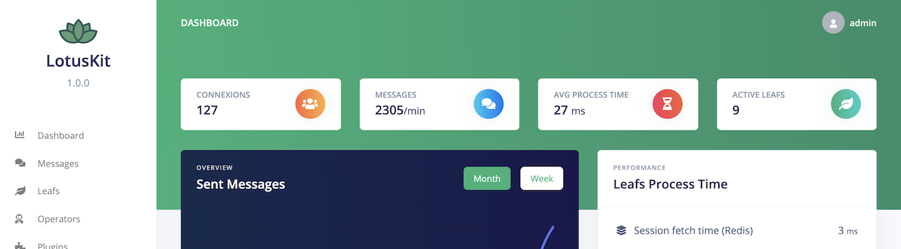

## About LotusKit
**LotusKit is a programmable turnkey chat server, flexible and open-source, integrable into your apps, websites and games.** It's fast and easy to use, with all the features you need to run a successful community. It is designed to be:

- **Fast and simple.** No clutter, no bloat, no complex dependencies. LotusKit is built with Node.js and socket.io so it’s quick and easy to deploy.

- **Powerful and extensible.** Customize, extend, and integrate LotusKit to suit your community. LotusKit's architecture is amazingly flexible, with a powerful Extension API.

## Installation

## Contributing
Thank you for considering contributing to LotusKit! Please read the Contributing guide to learn how you can help.

## Security Vulnerabilities
If you discover a security vulnerability within LotusKit, please send an e-mail to piavndev@gmail.com. All security vulnerabilities will be promptly addressed.

## License
LotusKit is open-source software licensed under the MIT License.

## Install dev environment
1. Install Node.js on your computer
2. Install packages: `npm install`
3. Fetch `.env` file or copy `.env.sample` to `.env` and fill it

## Start development server
1. Open terminal and run webpack: `npm run webpack`
2. Open another terminal (or Split in VisualStudioCode), and start server: `npm start`

## Used packages
`express`: Fast, unopinionated, minimalist web framework for Node.js.  
`dotenv`: Zero-dependency module that loads environment variables from a .env file into process.env.  
`redis`: Caching and storage for chat messages.  
`socket.io`: WebSockets tool for communication between client and server.  
`helmet`: Express middleware to secure your apps by setting various HTTP headers, which mitigate common attack vectors.  
`bluebird`: Promisify redis.  
`typescript`: Use types into node.js  
`ts-loader`: A TypeScript loader for webpack, which helps preprocess TypeScript files to create a JavaScript bundle.  
`webpack`: A module bundler, which is capable of transforming, bundling, or packaging just about any resource or asset.  
`webpack-cli`: A module that provides a flexible set of commands for developers to increase speed when setting up a custom webpack project.  
`webpack-node-externals`: A module to easily exclude Node.js modules from a webpack bundle.  
`log4js`: Logging tool to mannage logging levels, timestamping and storage into files.  
`jest`: Testing framework developed by Facebook. It works out of the box with minimal configuration and has in-built test runner, assertion library and mocking support.
`supertest`: Library for testing Node.js HTTP servers. It enables us to programmatically send HTTP requests such as GET, POST, PATCH, PUT, DELETE to HTTP servers and get results.
`ajv`: JSON schema validator for config.json

## Documentation
https://manifold.co/blog/building-a-chat-room-in-30-minutes-using-redis-socket-io-and-express-9e8e5a578675
https://github.com/dwyl/hapi-socketio-redis-chat-example

## Extensions ideas
- Email notifications on mentions
- Messages real-time translations
- Commands (/me, /help, ...)
- Online presence indicator
- Typing indicator
- Read receipts
- Bots
- Webhooks